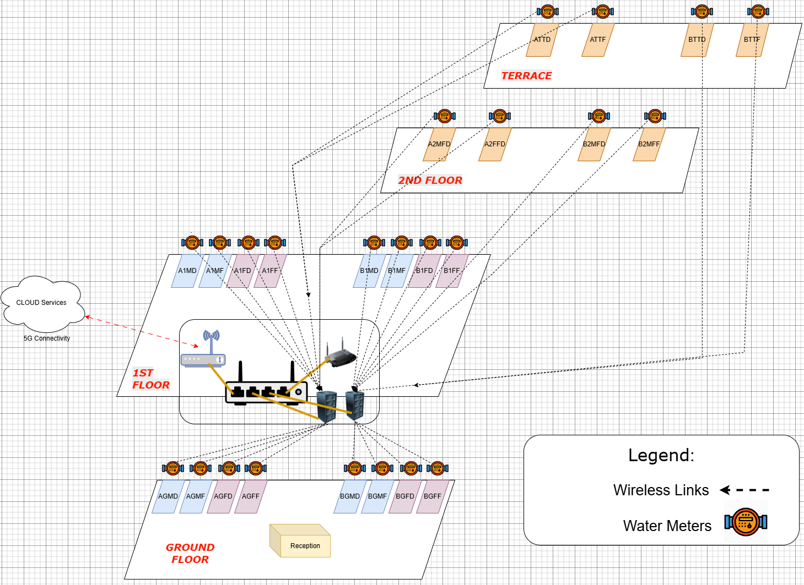
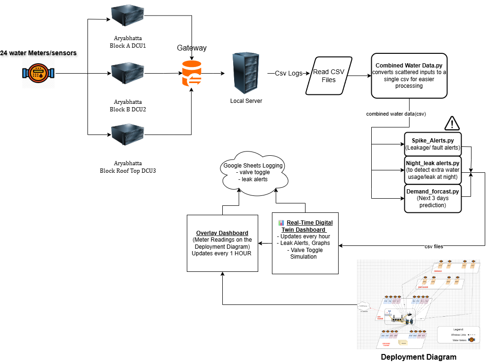
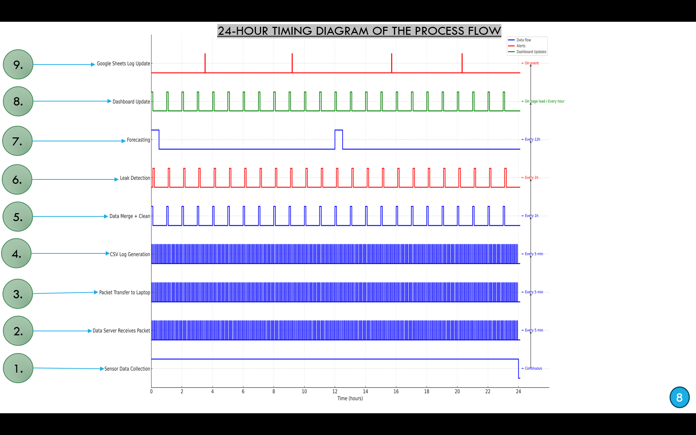
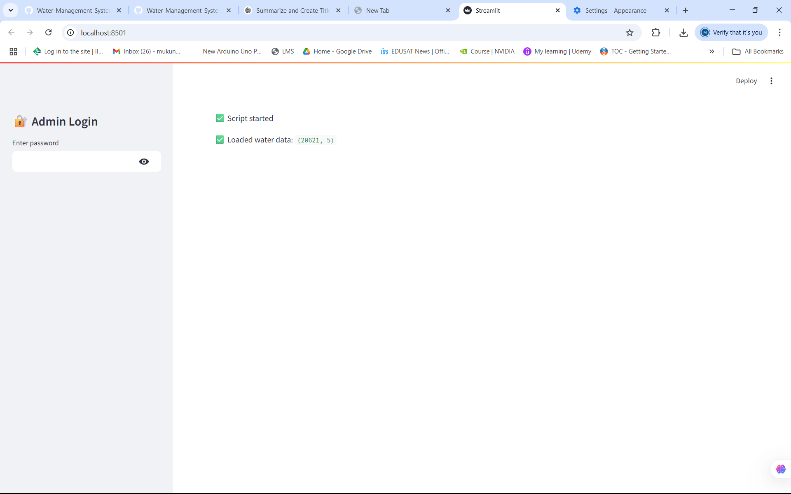
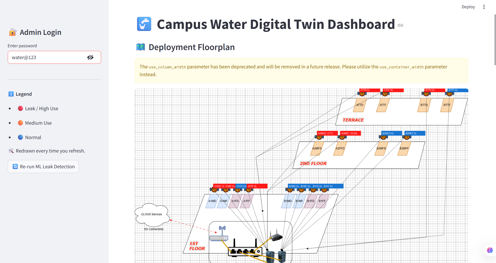
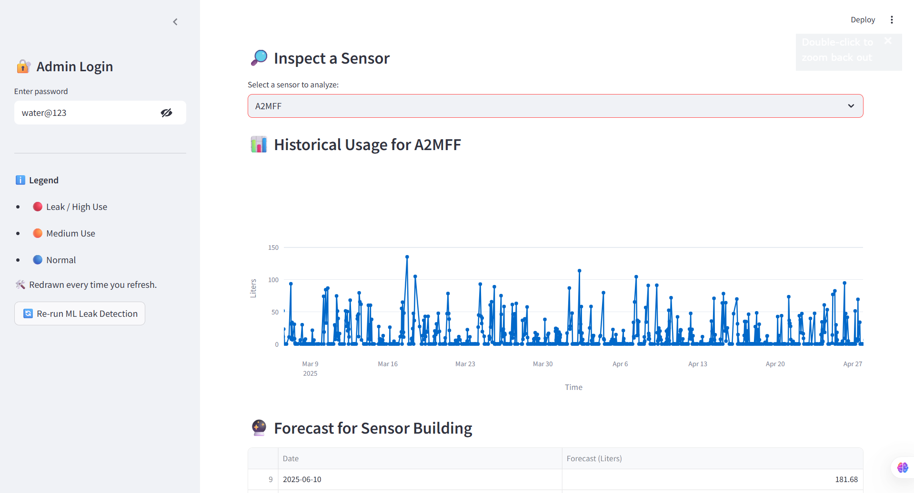
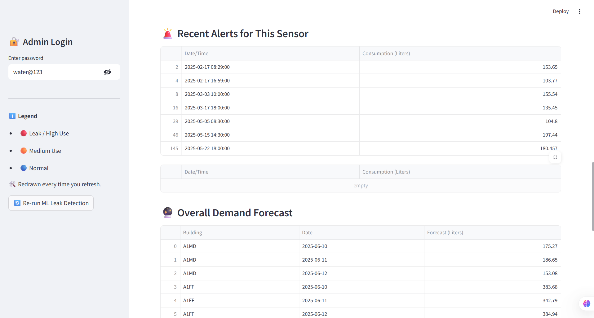
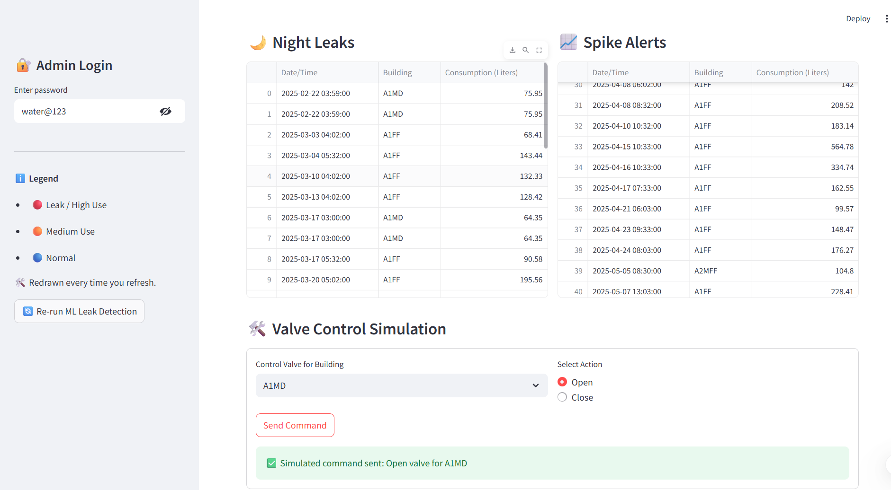
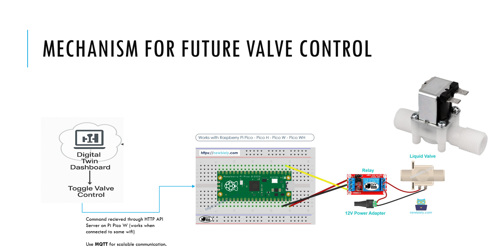

# 💧 Water Management System – IIIT B

> An end‑to‑end **Embedded IoT + Digital Twin** platform for real‑time campus water monitoring, forecasting, leak detection & 3D visualization.
---
## Project PPT

Download and see [Deployement Plan.pptx](CampusDeploymentPlanAutosaved].pptx) for complete explanation and deployment plan of this project.

---

## 📋 Table of Contents

1. [🚀 Project Overview](#-project-overview)
2. [🌟 Use Case Highlights](#-use-case-highlights)
3. [🏗 Architecture & Components](#-architecture--components)
4. [🖼 Visual Overview](#-visual-overview)
5. [⚙️ Setup & Installation](#️-setup--installation)
6. [🚀 Quick Start](#-quick-start)
7. [📂 Directory Structure](#-directory-structure)
8. [🛠 Key Technologies & Tags](#-key-technologies--tags)
9. [🤖 Valve Simulation & Attack Testing](#-valve-simulation--attack-testing)
10. [🤝 Contributing](#-contributing)
11. [📄 License](#-license)

---

## 🚀 Project Overview

The **IIIT B Water Management System** is a campus-scale IoT + Digital Twin solution that:

* Monitors real-time water usage from 24 meters
* Detects leaks and anomalies using ML
* Forecasts water demand using Prophet
* Provides 2D + 3D dashboard interfaces for live and historical monitoring
* Simulates valve control and anomaly testing

**Pipeline Flow**:

1. **IoT** → 24 meters → 3 DCUs (Block A, Block B, Terrace)
2. **Data Ingestion**: Python scripts merge logs into `combined_water_data.csv`
3. **ML**: Isolation Forest for leaks + Prophet for forecasting
4. **Dashboards**: Streamlit (2D), React + Three.js (3D)
5. **Automation**: Scheduled every 30 min using `run_all.sh` or systemd

---

## 🌟 Use Case Highlights

> Derived from real campus operations and pain points.

* 🔧 **Leak Detection → Immediate Dispatch**
  Alert from B1MF meter at 2 AM triggers auto alert → Facility team notified instantly

* 📊 **Consumption Trends → Tank Scheduling**
  Friday patterns in Block A → earlier refills or backup tank added

* 🔮 **Forecasting → Maintenance Planning**
  Holiday forecast = low usage → great time to clean tanks or flush pipelines

* 🚨 **High Spikes → Misuse Detection**
  BGMD spike on weekend → alerts for unauthorized activity

* 🧱 **Block Comparison → Infra Upgrade**
  Block B uses 40% more water → audit reveals old fixtures → low-flow taps installed

* 🧪 **Valve Simulation → Smart Saving**
  Simulation shows 15% lower loss when terrace valves auto-close at night

---

## 🏗 Architecture & Components

### 1. Embedded IoT Data Collection

* 24 water meters (domestic + flush)
* Raspberry Pi Pico W and ESP32 MCUs
* I²C + MQTT for collection, SCP for transfer

### 2. Data Ingestion & Analytics

```bash
python3 scripts/packet_to_combined_water_data.py
python3 scripts/validate_merge.py
python3 scripts/leak_detection.py
python3 scripts/forecast_demand.py
python3 scripts/generate_water_usage_plots.py
```

### 3. Dashboards

**Streamlit (2D)**

```bash
cd dashboard
streamlit run enhanced_dashboard2.py
```

**React + Three.js (3D)**

```bash
cd 3D_DT
npm install
npm run dev
```

### 4. Automation

```ini
[Unit]
Description=Run WMS pipeline every 30min

[Timer]
OnBootSec=5min
OnUnitActiveSec=30min

[Install]
WantedBy=timers.target
```

---

## 🖼 Visual Overview

### 🧭 System Architecture



### 🏢 Floor Plan Mapping


### 🔁 Block Diagram Flow



### ⏰ 24-Hour Timing Overview



### 🌐 Live Dashboard UI

| Main View - overlay of leaks     | other analytics and simulations     |
| -------------------------------- | ----------------------------------- |
|                |               |
|    |   | |

### 💧 Valve Simulation Preview



---

## ⚙️ Setup & Installation

```bash
git clone https://github.com/mukund01001/Water-Management-System-IIITB.git
cd Water-Management-System-IIITB
python3 -m venv venv
source venv/bin/activate
pip install -r requirements.txt
cd 3D_DT
npm install
```

---

## 🚀 Quick Start

```bash
./run_all.sh
cd dashboard
streamlit run enhanced_dashboard2.py
cd ../3D_DT
npm run dev
```

---

## 📂 Directory Structure

```
.
├── 3D_DT/            # React + Three.js UI
├── dashboard/        # Streamlit dashboard
├── data/             # CSVs from meters
├── plots/            # Forecast + leak visuals
├── scripts/          # Data ingestion, ML, plotting
├── docs/             # Images for README/slides
├── run_all.sh        # Scheduler runner
└── README.md
```

---

## 🛠 Key Technologies & Tags

| Layer      | Tools & Libraries                   |
| ---------- | ----------------------------------- |
| IoT        | MQTT, I²C, ESP32, Pico W            |
| Backend    | Python, pandas, SCP, cron/systemd   |
| ML         | Isolation Forest, Prophet           |
| Dashboards | Streamlit, Plotly, React, Three.js  |
| Cloud Logs | Google Sheets API (for alerts/logs) |

---

## 🤖 Valve Simulation & Attack Testing

**Valve Control Logic**: (slide 17)

* MQTT via HTTP API to Pico W
* Supports smart closure automation, alerts, override controls

**Attack Detection Methods**: (slide 18)

* Spoofing, Replay, DoS, Command Injection
* Isolation Forest + thresholding to detect

**Leakage & Clog Simulation** (slide 19)

* Types: Constant, Night-only, Gradual Rise
* Clogs: Partial, Sudden Drop, Intermittent

**Anomaly Simulator** (slide 20)

* Drift, Freeze, Spikes, Missing Timestamps
* Outputs annotated CSVs for dashboard testing

---


## 🤝 Contributing

```bash
git checkout -b feat/your-feature
# Make changes
# Commit and push
```

Then open a PR with a description.

---
---
## 📚 References

See [REFERENCES.md](./REFERENCES.md) for research papers, tools, and APIs used in this project.

## 📄 License

MIT License © 2025
