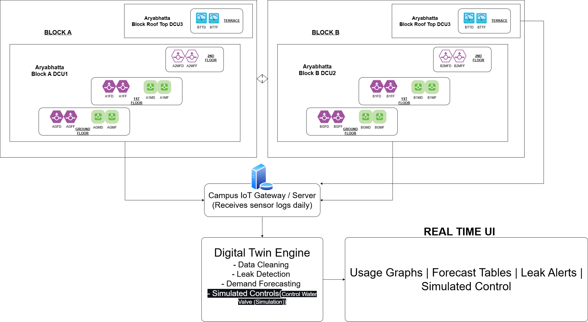

# 💧 Water Management System – IIIT B

> An end‑to‑end **Embedded IoT + Digital Twin** platform for real‑time campus water monitoring, forecasting, leak detection & 3D visualization.
---
## Project PPT

Download and see [Deployement Plan.pptx](CampusDeploymentPlanAutosaved].pptx) for complete explanation and deployment plan of this project.

---

## 📋 Table of Contents

1. [🚀 Project Overview](#-project-overview)
2. [🌟 Use Case Highlights](#-use-case-highlights)
3. [🏗 Architecture & Components](#-architecture--components)
4. [🖼 Visual Overview](#-visual-overview)
5. [⚙️ Setup & Installation](#️-setup--installation)
6. [🚀 Quick Start](#-quick-start)
7. [📂 Directory Structure](#-directory-structure)
8. [🛠 Key Technologies & Tags](#-key-technologies--tags)
9. [🤖 Valve Simulation & Attack Testing](#-valve-simulation--attack-testing)
10. [🤝 Contributing](#-contributing)
11. [📄 License](#-license)

---

## 🚀 Project Overview

The **IIIT B Water Management System** is a cutting-edge **IoT + Digital Twin** solution meticulously designed to optimize water resource management within the campus environment. It transforms raw sensor data into actionable insights, providing comprehensive control and visibility over water consumption.

**Core Pipeline Flow**:

1.  **IoT Data Collection**: Readings from 24 distributed water meters are gathered via embedded systems (Raspberry Pi Pico W, ESP32 MCUs) using I²C and MQTT, then securely transferred via SCP.
2.  **Automated Data Ingestion**: Python scripts seamlessly merge raw sensor logs into a unified `combined_water_data.csv` for analysis.
3.  **Machine Learning Analytics**:
    * **Isolation Forest** is employed for robust and accurate leak and anomaly detection.
    * **Prophet** models forecast future water demand trends.
4.  **Interactive Dashboards**:
    * A **Streamlit** application provides an intuitive 2D interface for comprehensive monitoring and insights.
    * A **React + Three.js** application offers an immersive 3D digital twin visualization.
5.  **Scheduled Automation**: A `run_all.sh` script, integrated with `systemd` timers, orchestrates the entire data processing and analytics pipeline every 30 minutes, ensuring the dashboards are always up-to-date.

---

**Pipeline Flow**:

1. **IoT** → 24 meters → 3 DCUs (Block A, Block B, Terrace)
2. **Data Ingestion**: Python scripts merge logs into `combined_water_data.csv`
3. **ML**: Isolation Forest for leaks + Prophet for forecasting
4. **Dashboards**: Streamlit (2D), React + Three.js (3D)
5. **Automation**: Scheduled every 30 min using `run_all.sh` or systemd

---

## 🌟 Use Case Scenarios

Our system addresses real-world operational challenges and pain points within campus water management:

* 🔧 **Intelligent Leak Detection & Rapid Response**: An alert from a specific meter (e.g., `B1MF`) at 2 AM, indicating an unexpected flow, immediately triggers a notification to the facility management team, enabling swift action to prevent water wastage.
* 📊 **Optimized Consumption Trends for Tank Scheduling**: Analysis of historical Friday consumption patterns in a specific block (e.g., Block A) allows for proactive adjustments to tank refill schedules or the addition of backup tanks to meet predictable higher demand.
* 🔮 **Proactive Forecasting for Maintenance Planning**: Forecasts predicting low water usage during upcoming holidays provide an ideal window for scheduling essential maintenance activities like tank cleaning or pipeline flushing, minimizing disruption.
* 🚨 **High Spike Alerts for Misuse Detection**: An unusual spike in consumption from a common area meter (e.g., `BGMD`) during a weekend can trigger an alert, prompting investigation into potential unauthorized activity.
* 🧱 **Block Comparison for Infrastructure Upgrades**: Comparative analysis revealing significantly higher water usage in one block (e.g., Block B using 40% more) can initiate an audit, uncover inefficient old fixtures, and guide targeted upgrades to low-flow taps.
* 🧪 **Valve Simulation for Smart Savings**: Simulations demonstrate potential water savings (e.g., 15% reduction in loss) by implementing automated rules like closing terrace valves during night hours.
---
---

## ✨ Key Features & Highlights

* **Real-time IoT Monitoring:** Collects and processes water usage data from 24 smart meters across campus (domestic and flush points).
* **Intelligent Leak & Anomaly Detection:** Leverages **Isolation Forest (ML)** to accurately identify both subtle night-time leaks and sudden consumption spikes.
* **Predictive Demand Forecasting:** Utilizes **Prophet (ML)** to forecast future water demand, aiding in optimal tank scheduling and resource planning.
* **Dual Dashboard Interfaces:**
    * **2D Streamlit Dashboard:** Provides a user-friendly, tabbed interface for live floorplan status, historical usage, detailed alerts, and overall campus insights.
    * **3D React + Three.js Visualization:** Offers an immersive 3D digital twin experience for spatial data analysis.
* **Automated Data Pipeline:** Scheduled processes (via `run_all.sh` / `systemd`) ensure continuous data ingestion, ML model inference, and dashboard updates every 30 minutes.
* **Simulated Valve Control:** Features a conceptual interface for testing smart valve closure automation strategies.

---
## 🏗 Architecture & Components
The system is designed with modularity and scalability in mind, encompassing embedded hardware, a robust data pipeline, and intuitive visualization layers.

### 1. Embedded IoT Data Collection

* 24 water meters (domestic + flush)
* Raspberry Pi Pico W and ESP32 MCUs
* I²C + MQTT for collection, SCP for transfer

* **Water Meters:** 24 digital water meters strategically placed (domestic + flush points).
* **Microcontrollers:** Utilizes energy-efficient Raspberry Pi Pico W and ESP32 MCUs for localized data acquisition.
* **Communication Protocols:** Employs I²C for sensor communication and MQTT for efficient, lightweight data transmission to gateway devices.
* **Data Transfer:** Secure Copy Protocol (SCP) is used for reliable transfer of aggregated data logs.

### 2. Data Ingestion & Analytics

This sequence of Python scripts processes raw data, performs analytics, and prepares data for the dashboards:

```bash
python3 scripts/packet_to_combined_water_data.py   # Aggregates raw packet data into combined CSV
python3 scripts/validate_merge.py                   # Ensures data consistency and integrity
python3 scripts/leak_detection.py                   # Runs ML for leak and anomaly detection
python3 scripts/forecast_demand.py                  # Generates future water demand forecasts
python3 scripts/generate_water_usage_plots.py       # (Optional: Generates additional static plots for analysis)
```

### 3. Dashboards

**Streamlit (2D)**

```bash
cd dashboard
streamlit run enhanced_dashboard2.py
```

**React + Three.js (3D)**

```bash
cd 3D_DT
npm install
npm run dev
```

### 4. Automation

```ini
[Unit]
Description=Run WMS pipeline every 30min

[Timer]
OnBootSec=5min
OnUnitActiveSec=30min

[Install]
WantedBy=timers.target
```

---

## 🖼 Visual Overview

### 🧭 System Architecture
A high-level overview of how various components of the IoT and Digital Twin system are interconnected.


### 🏢 Floor Plan Mapping



### 🔁 Block Diagram Flow


### ⏰ 24-Hour Timing Overview


### 🌐 Live Dashboard UI

| Main View - overlay of leaks     | other analytics and simulations     |
| -------------------------------- | ----------------------------------- |
|                |               |
|                |               |

### 💧 Valve Simulation Preview


---

## ⚙️ Setup & Installation

Follow these steps to get the project up and running on your local machine:

```bash
# 1. Clone the repository
git clone [https://github.com/mukund01001/Water-Management-System-IIITB.git](https://github.com/mukund01001/Water-Management-System-IIITB.git)
cd Water-Management-System-IIITB

# 2. Create and activate a Python virtual environment
python3 -m venv venv
source venv/bin/activate # On Windows, use `venv\Scripts\activate`

# 3. Install Python dependencies
pip install -r requirements.txt

# 4. Install Node.js dependencies for the 3D dashboard
cd 3D_DT
npm install
```
Important: Ensure you have python3, pip, and npm (Node.js and npm) installed on your system.


---

## 🚀 Quick Start

After completing the Setup & Installation, follow these steps to run the core functionalities:

Generate/Update Combined Water Data:

Ensure your raw sensor data is processed into combined_water_data.csv. If you have new packet data or need to re-aggregate:

```bash

python scripts/packet_to_combined_water_data.py
```
## If applicable, also run: python scripts/import_data_from_individual_csvs.py
Generate Leak Alerts & Demand Forecasts:

Run the ML-driven scripts to populate the alert and forecast CSVs:

```bash

python scripts/leak_detection.py
python scripts/forecast_demand.py
Verify config.yaml: Ensure forecast_days: 3 and buildings list are correctly set in config.yaml.
```
Run the Automation Script (Optional, but Recommended for Continuous Operation):

This script executes the data processing and ML pipeline at configured intervals.

```bash

./run_all.sh
```
## For production-like scheduling, configure this with systemd timers as shown in Architecture.
Launch the Streamlit (2D) Dashboard:

```bash

cd dashboard
streamlit run enhanced_dashboard.py
```
Access the dashboard in your web browser (usually http://localhost:8503). Use water@123 for admin login.

Click "🔄 Reload All Data (Clear Cache)" in the sidebar if you manually update data files while the dashboard is running.

Launch the React + Three.js (3D) Dashboard:

```bash

cd ../3D_DT
npm run dev
```
Access the 3D visualization in your web browser (usually http://localhost:5173 or similar).
---

## 📂 Directory Structure

```
.
├── 3D_DT/              # React + Three.js application for 3D visualization
├── dashboard/          # Streamlit application for 2D real-time monitoring
├── data/               # Contains processed CSVs (combined_water_data, alerts, forecasts) and deployment diagrams
├── plots/              # Stores generated forecast plots (PNGs)
├── scripts/            # Python scripts for data ingestion, validation, ML (leak detection, forecasting)
├── docs/               # (Optional) Project documentation and additional images/resources
├── Dashboard_pics/     # Contains updated screenshots for README.md
├── .github/            # (Optional) GitHub Actions workflows for CI/CD
├── .gitignore          # Files/directories to ignore in Git
├── config.yaml         # Configuration file for building IDs, forecast days etc.
├── requirements.txt    # Python dependencies
├── run_all.sh          # Shell script to run the full data pipeline
└── README.md           # This comprehensive project overview
```

---

---

## 🛠 Core Technologies

Our system leverages a robust stack of technologies across different layers:

| Layer              | Tools & Libraries                                         |
| :----------------- | :-------------------------------------------------------- |
| **Embedded IoT** | MQTT, I²C, ESP32, Raspberry Pi Pico W                     |
| **Backend & Data** | Python, pandas, NumPy, SCP, `cron` / `systemd`            |
| **Machine Learning**| `scikit-learn` (Isolation Forest), `Prophet` (Meta)       |
| **Dashboards** | `Streamlit`, `Plotly`, `React`, `Three.js`                |
| **Cloud Integration**| Google Sheets API (for alert/log synchronization, if implemented) |
| **Version Control**| Git, GitHub                                               |

---

## 🧪 Advanced Features: Valve Simulation & Testing

This project incorporates advanced functionalities for simulating real-world scenarios and testing system resilience.

### 1. Valve Control Logic

(Refer to `Deployment Plan.pptx`, Slide 17 for detailed schematics)
* **Mechanism:** Implemented conceptually via MQTT over HTTP API commands sent to a Pico W microcontroller.
* **Capabilities:** Supports automated smart valve closure based on detected events, real-time alerts upon valve state changes, and manual override controls for facility management.

### 2. Attack Detection Methods

(Refer to `Deployment Plan.pptx`, Slide 18)
* **Threat Models:** Detection mechanisms are designed to identify various cyber-physical attacks:
    * **Spoofing:** Detecting falsified sensor readings.
    * **Replay Attacks:** Identifying re-sent legitimate data to deceive the system.
    * **Denial of Service (DoS):** Recognizing attempts to disrupt data flow or system operations.
    * **Command Injection:** Protecting against unauthorized commands to actuators.
* **Detection Tools:** Primarily leverages **Isolation Forest** (ML) combined with intelligent thresholding and pattern recognition to flag suspicious data.

### 3. Leakage & Clog Simulation

(Refer to `Deployment Plan.pptx`, Slide 19)
* **Leakage Types:** The system can simulate various leakage scenarios for testing and training:
    * **Constant Leak:** A continuous, low-level flow.
    * **Night-only Leak:** Leakage occurring exclusively during off-peak hours.
    * **Gradual Rise Leak:** Leakage that slowly increases in magnitude over time.
* **Clog Types:** Simulation capabilities extend to pipe blockages:
    * **Partial Clog:** Reduced flow without complete stoppage.
    * **Sudden Drop:** Abrupt decrease in consumption.
    * **Intermittent Clog:** Irregular or fluctuating flow patterns.

### 4. Anomaly Simulator

(Refer to `Deployment Plan.pptx`, Slide 20)
* **Test Cases:** A dedicated simulator can generate various data anomalies to robustly test the detection models:
    * **Drift:** Gradual, subtle changes in sensor readings.
    * **Freeze:** Sensor readings becoming stagnant or stuck.
    * **Spikes:** Sudden, temporary increases in readings.
    * **Missing Timestamps:** Simulating data gaps or communication failures.
* **Output:** The simulator outputs annotated CSVs, providing labeled test data for development and validation of detection algorithms, directly usable with the dashboard.

---

## 🤝 Contributing

We welcome contributions to enhance this project!

1.  Fork the repository.
2.  Create a new branch for your feature or bug fix:
    ```bash
    git checkout -b feat/your-feature-name
    ```
3.  Make your changes and ensure tests pass (if applicable).
4.  Commit your changes with a clear, concise message.
5.  Push your branch to your forked repository.
6.  Open a Pull Request to the `main` (or `master`) branch of the original repository, providing a detailed description of your changes.

---

## 🔗 References

For research papers, tools, and APIs that informed this project's development, please see the dedicated [**REFERENCES.md**](./REFERENCES.md) file.

---

## 📄 License

This project is licensed under the MIT License – see the [LICENSE](LICENSE) file for details.
© 2025
